__Latest version 0.6.0__

# EchoSightPro #

  

## 1. Overview ##
__EchoSight Pro__ is a software beamforming based ultrasound framework, which I developed on my own for fun. Compared to exsiting ultrasound research platform for public usage, such as Field II, Focus, KWAVE, MUST and ect focusing on sound field simulation, __EchoSight Pro__ is of different goal. 

It is an efficiency oriented, engineering based and product level architectured for handling raw ultrasound channel signal data, no matter those data is from simulation, real data captured from machine. It can be used by cooprating with those research platform for acadamic research or advanced prototype machine evaluation. 

To know the existing research platform check the link below

-Field II https://field-ii.dk/

-Focus    https://www.egr.msu.edu/~fultras-web/

-MUST     https://www.biomecardio.com/MUST/

-KWave    http://www.k-wave.org/index.php

What makes __EchoSight Pro__  can work in __real time__. Due to its design target, __EchoSight Pro__ can run on your normal computer __with GPU__ or even __without GPU__ both. 

__EchoSight Pro__ support __Recursive Transmit Beamformation__, __Synthetic Aperture__, __Multiple Line Aquisition__,  __Steering__ scanning, it can support all of those features, while working in __Real Time__. 

It achieves high quality commercial level, no matter from ultrasound theoritical perspective or from engineering design point of view.

## 2. Predecessor EchoSight History ##
Previously, I have developed its predecessor EchoSight, which has done already, but not opened for public usage. EchoSight is support real time software beam forming, including IQ beam forming, Recursive Transmit Beamforming, Synthetic beamforming, Multiple Line Acqusition beam forming, Steering scan already, and can work on CPU mode,  and GPU mode. 

Old EchoSight real time running screen shot, plz check the images below(if U see any grid artifact, which caused by your browser display,  plz zoom in/out.)

  

  

If you have any intesests on its predecessor, you check the link below for previous development log

https://blog.csdn.net/gamer_gerald/article/details/135611461?spm=1001.2014.3001.5501

## 3. Functionality Guidance ##
__EchoSightPro__ provides many useful functions for research and evaluation.

Pure Software based Beam Forming

Multiple Line Acqusition Beam Forming

Recursive Transmit Beam Forming

Synthetic Aperture Beam Forming

For more information, please check the __EchoSightPro User Guidance__ mannual.

  
## 4. Performance Evaluation ##

__EchoSightPro__ actual performance will vary depends on your computer hardware. The following evaluation is based on my testing hardware. 

| CPU    | MEMORY | Integrated GPU | OS |
|:------:|:------:|:------:|:------:|
|Intel 12th i5-12400|16GB(2400MHz)|Intel UHD730 |WIN 10|

EchoSight-Pro provide 2 types of configuration: 

1. pure CPU setting;
2. integrated GPU setting;

__EchoSight-Pro v0.5.1 Data Rate Testing Summary(Unit: Giga Byte per Second)__

  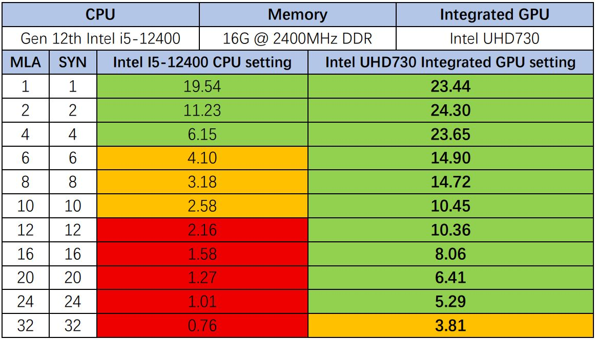

__Notice__: when data rate is too high (like above 20GB/sec), the data rate is becoming unstable from time to time. I do NOT want to pick good data to make it beautiful or reasonable. I just 
record what is monitored. 

__Full Chain Data Rate__

Full chain data rate is the __Core Indicator__ for software beamforming-based ultrasound scanner. It describes how much data it can handle under specific MLA/SYN settings;

Given the same hardware(__without__ discrete GPU), EchoSight-Pro is the world's fastest framework for __CPU__ and __integrated GPU__ setting both with synthetic, RTB, MLA supported.

(If not, please provide information to echosight_pro@126.com, I will correct my description mistakes.)

__Integrated GPU Setting Status__

In Integrated GPU setting status, the system runs in real time with small memory footprint， pretty low CPU loading and __NO__ discrete GPU needed at all.

  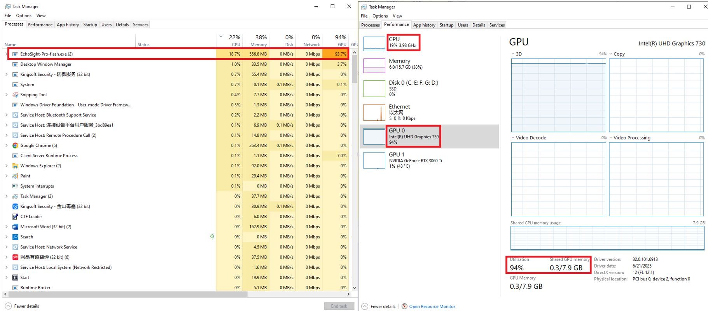

The performance testing is based on Intel i5-12400(with an UHD730 integrated GPU built in), it is an extremely weak hardware (sorry Intel, that's the fact).
Especially its integrated GPU is far behind main stream discreted GPU.

  

The target of EchoSight-Pro is NOT to provide output with strong hardware, but to maximize __efficiency__ with hardware as weak as possible, through algorithm optimization and engineering architecture design

## 5. Research Interface ##

Since version 0.5.1, a research interface module is added in for personalized academic research needs. The research module is provided with source codes together, you can do your personalized work through it.
Through the interface you can work on the data at different stage.

For example, if you want to “right half image gray scale value to be reverted”. You need the following 3 simple steps to make your job done.

__Step 1:Open Research Project Source Codes__

  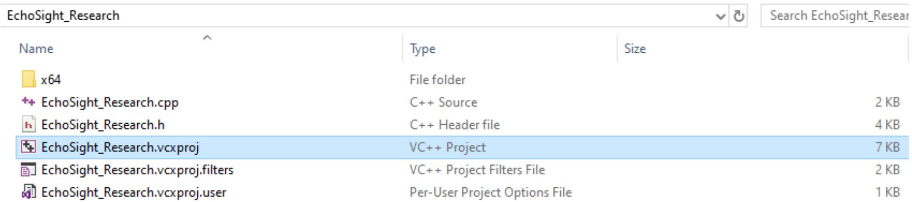

__Step 2:Modify the Codes based on Your Needs__

  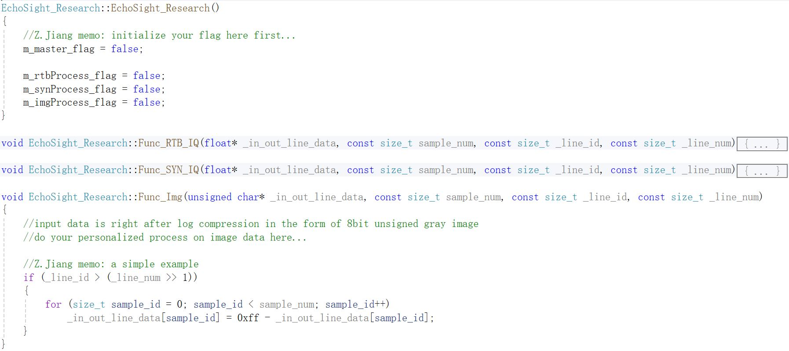

__Step 3:Build the Project to Get the DLL file and copy it to bin folder, replace the existing one__

  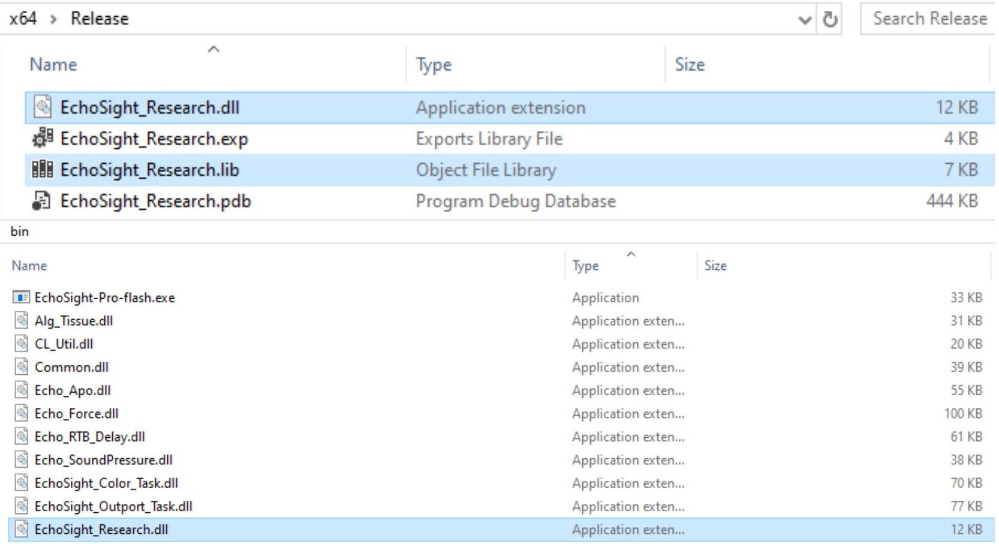

After all the 3 steps are done, start EchoSight-Pro to check your result. You will see the final output as you expected.

  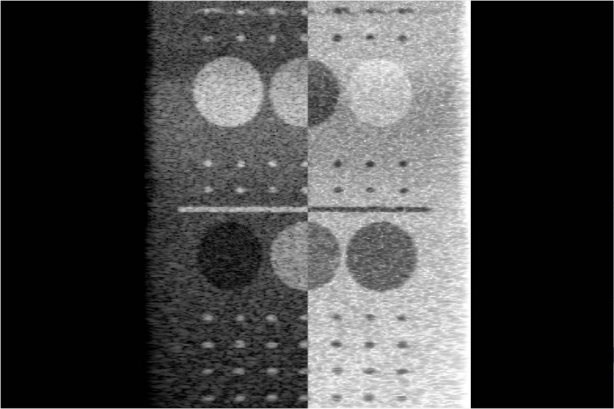

What is more important, through research interface module, not only gray scale data can be modified, but also __IQ data after RTB__ or ater __synthetic__  can be modified according to your needs as well.

Also, as source codes for research module is provided, you can __debug__ on it as well.

## 6. Hardware Check ##

__Change hardware settings__

The EchoSight-Pro support CPU based computaion and integrated GPU computation both, you can change the setting in the configuration file "Settings\task\EchoSightProChain.xml"

  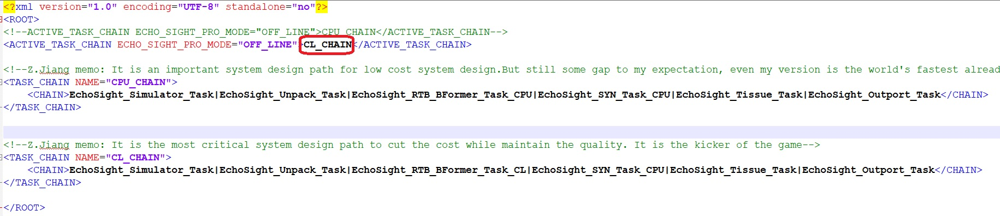

if you want it work with pure CPU, make the "ACTIVE TASK CHAIN" configured as __CPU_CHAIN__, want to make it work on your integrated GPU, please set it as __CL_CHAIN__

__Confirm hardware settings__

You can confirm your settings from command window information or your task manager loading as below

  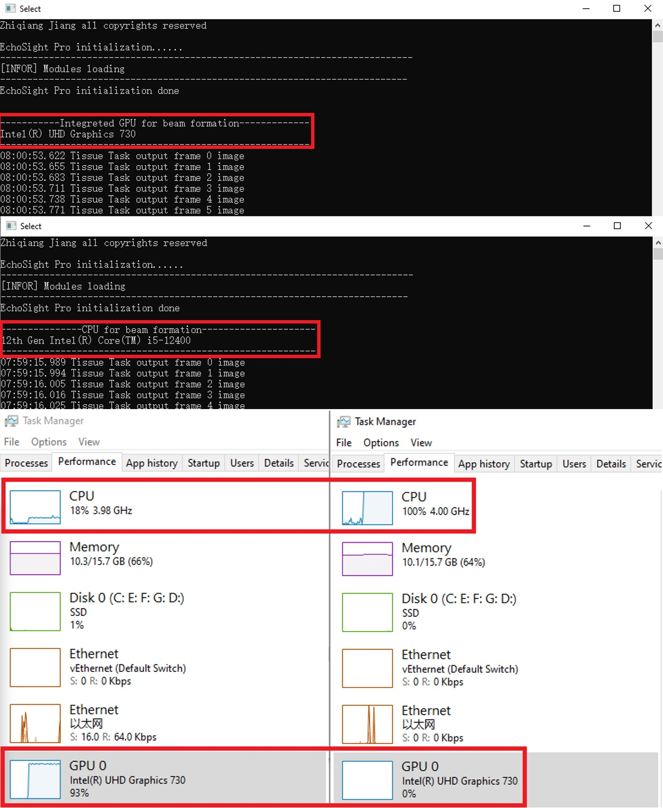

## 7. Image Output ##

Channel data is processed in EchoSight-Pro in real time, with beam formation, recursive transimit beamforming calculation, multiple line acquistion calculation, synthetic aperture processing all together. After all the steps(plus some basic post BF steps)the image output is generated.  

__v0.5.0 image MLA1/SYN1(Left) MLA24/SYN24(Right)__

  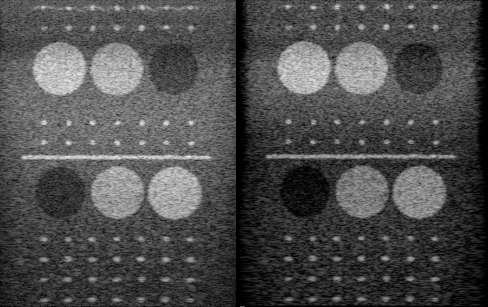

Both of CPU setting and Integrated GPU setting provide the same output(some quantization errors may exist).

__CPU setting output(Left) Integrated GPU setting output(Right)__

  

__Carotid image using vivo data__

  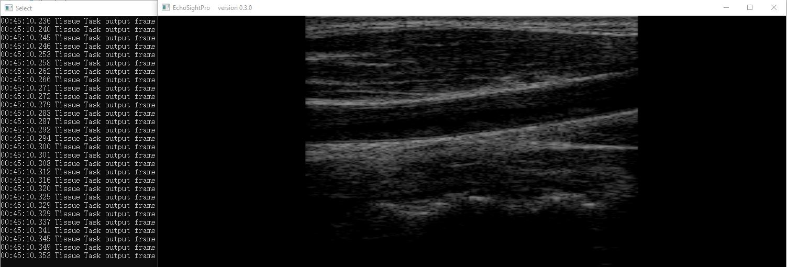

__Curve image using simulation data__

  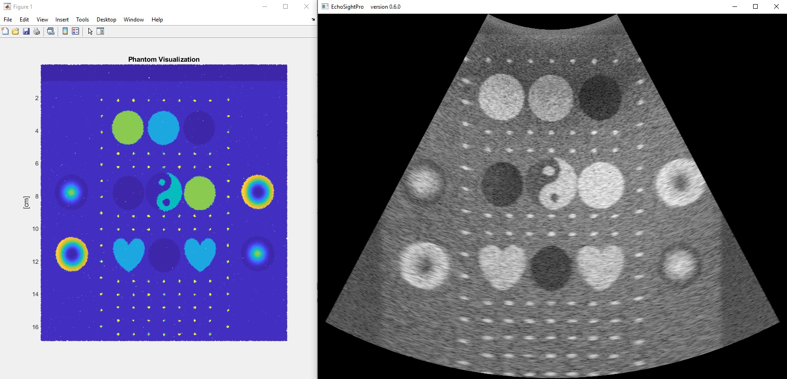

__Curve image synthetic on/off comparsion__

  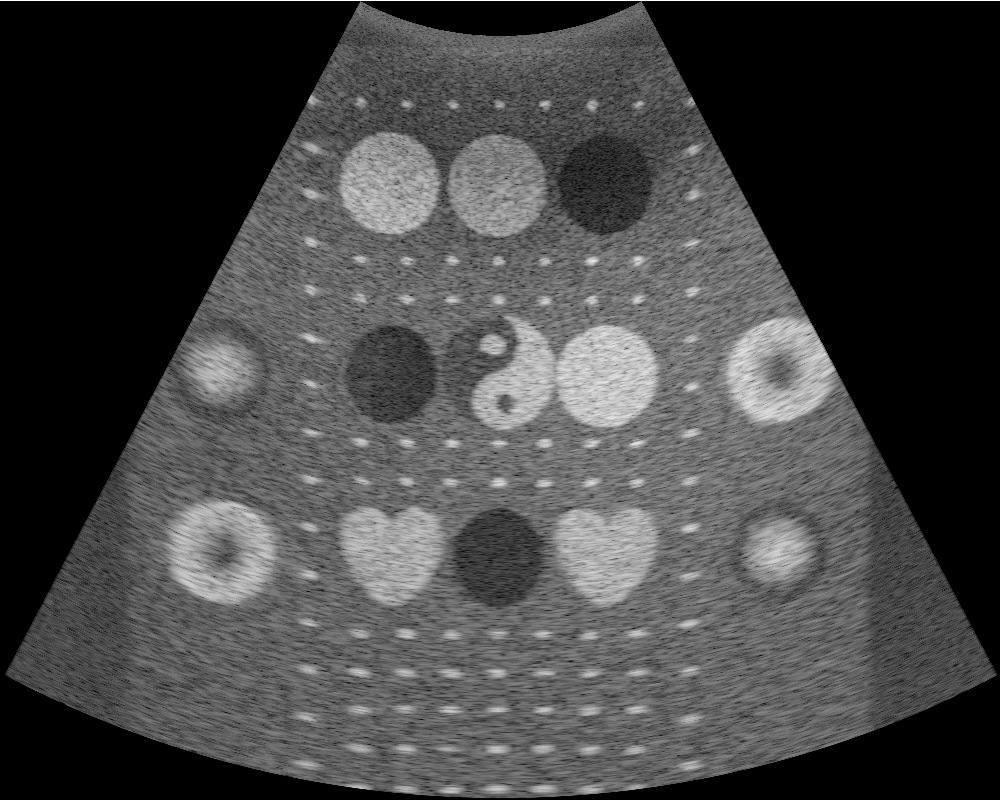

## 8. Down Load and Usage ##

To get the full software package and use 

1. go to folder of the corresponding version(download the latest version is suggested)
2. down load all the zip files(due to 24MB limits, package might divded into 2 or 3 files)
3. unzip the *.7z file, you will get a folder named "EchoSightPro_version_X.X.X"
4. click the Start EchoSight-Pro.bat file to run the EchoSight-Pro

Most of version package contains data already, but some versions' package may not. 

In such case, please download the data in "IQ channel data for EchoSight-Pro" folder.

Highly suggest you refer the document in the software package __EchoSight-Pro User Guidance.pdf__ 

  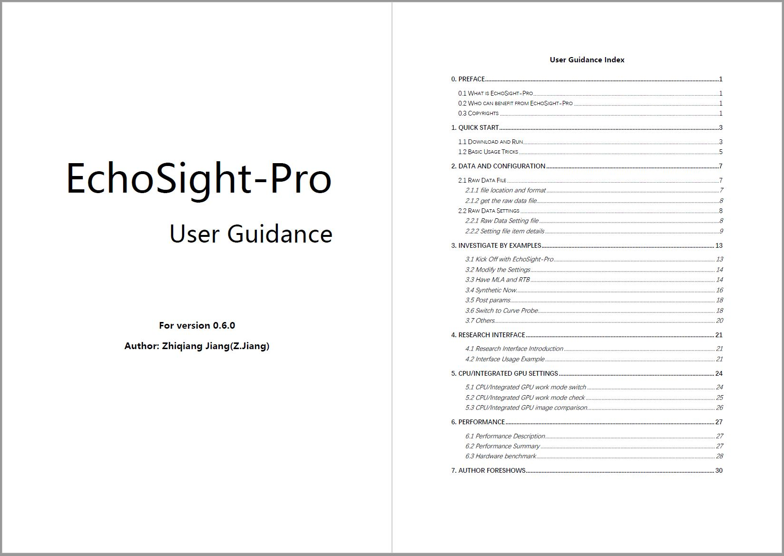

## 9. Platform ##

The __EchoSightPro__ is aviable on windows platform only. 

PS: It is written by C++ (mostly ISO 20) and plused a simple OpenGL display, which makes it completely possible to transplant to other OS. But that is not my intersts by now.

## 10. Copyrights and Version  ##

Attention, personalized license is on this software. Check license declare for details. But I make it brief here for guys. If it is for university study, academic research, lab research without any commercial purpose, no limits at all. For commercial purpose, prototype machine build, it can only be used for hardware evaluation and run independently. Trying to integrate to your product for bussiness purpose is __strictly forbidden__. 

EchoSight-Pro will pause from time to time(it will pause 1 sec every 20 sec), it is not a bug. I added it in, I think this will not affect normal usage.

  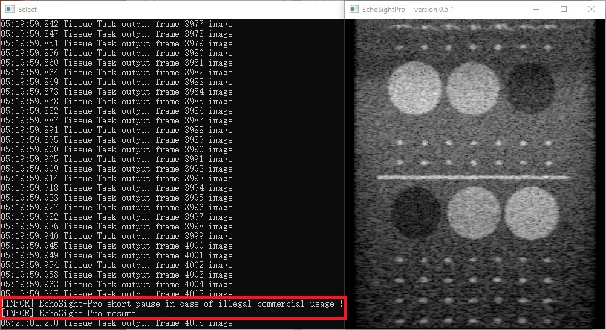

The version update is __random__, it is an interets based project developed completely on my own in my spare time.

