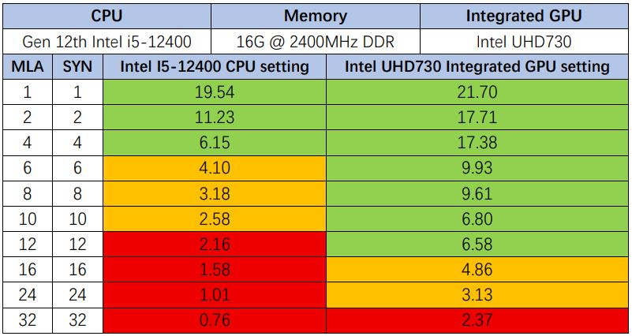

# EchoSightPro #

  

## Overview ##
__EchoSight Pro__ is a software beamforming based ultrasound framework, which I developed on my own for fun. Compared to exsiting ultrasound research platform for public usage, such as Field II, Focus, KWAVE, MUST and ect focusing on sound field simulation, __EchoSight Pro__ is of different goal. 

It is an efficiency oriented, engineering based and product level architectured for handling raw ultrasound channel signal data, no matter those data is from simulation, real data captured from machine. It can be used by cooprating with those research platform for acadamic research or advanced prototype machine evaluation. 

To know the existing research platform check the link below

-Field II https://field-ii.dk/

-Focus    https://www.egr.msu.edu/~fultras-web/

-MUST     https://www.biomecardio.com/MUST/

-KWave    http://www.k-wave.org/index.php

What makes __EchoSight Pro__  can work in __real time__. Due to its design target, __EchoSight Pro__ can run on your normal computer __with GPU__ or even __without GPU__ both. 

__EchoSight Pro__ support __Recursive Transmit Beamformation__, __Synthetic Aperture__, __Multiple Line Aquisition__,  __Steering__ scanning, it can support all of those features, while working in __Real Time__. 

It achieves high quality commercial level, no matter from ultrasound theoritical perspective or from engineering design point of view.

## Predecessor EchoSight History ##
Previously, I have developed its predecessor EchoSight, which has done already, but not opened for public usage. EchoSight is support real time software beam forming, including IQ beam forming, Recursive Transmit Beamforming, Synthetic beamforming, Multiple Line Acqusition beam forming, Steering scan already, and can work on CPU mode,  and GPU mode. 

Old EchoSight real time running screen shot, plz check the images below(if U see any grid artifact, which caused by your browser display,  plz zoom in/out.)

  

  

If you have any intesests on its predecessor, you check the link below for previous development log

https://blog.csdn.net/gamer_gerald/article/details/135611461?spm=1001.2014.3001.5501

## License ##

Attention, personalized license is on this software. Check license declare for details. But I make it brief here for guys. If it is for university study, academic research, lab research without any commercial purpose, no limits at all. For commercial purpose, prototype machine build, it can only be used for hardware evaluation and run independently. Trying to integrate to your product is strictly forbidden. 

## Functionality Guidance ##
__EchoSightPro__ provides many useful functions for research and evaluation.

Pure Software based Beam Forming

Multiple Line Acqusition Beam Forming

Recursive Transmit Beam Forming

Synthetic Aperture Beam Forming

For more information, please check the __EchoSightPro User Guidance__ mannual.

  
## Performance Evaluation ##

__EchoSightPro__ actual performance will vary depends on your computer hardware. The following evaluation is based on my testing hardware. 

| CPU    | MEMORY | Integrated GPU | OS |
|:------:|:------:|:------:|:------:|
|Intel 12th i5-12400|16GB(2400MHz)|Intel UHD730 |WIN 10|

EchoSight-Pro provide 2 types of configuration: 

1. pure CPU setting;
2. integrated GPU setting;

__EchoSight-Pro v0.4.0 Performance Testing Summary(Unit: Giga Byte per Second)__

  

__Full Chain Data Rate__

Full chain data rate is the __Core Indicator__ for software beamforming-based ultrasound scanner. It describes how much data it can handle under specific MLA/SYN settings;

__Integrated GPU Setting Status__

In Integrated GPU setting status, the system runs in real time with small memory footprint， pretty low CPU loading and __NO__ discrete GPU needed at all.

  

## Image Output ##

Channel data is processed in EchoSight-Pro in real time, with beam formation, recursive transimit beamforming calculation, multiple line acquistion calculation, synthetic aperture processing all together, the output is generated.  

__v0.4.0 image MLA1/SYN1(Left) MLA24/SYN24(Right)__

  

Both of CPU setting and Integrated GPU setting provide the same output.

__CPU setting output(Left) Integrated GPU setting output(Right)__

  

## Down Load and Usage ##

For the version before 0.2.0, down load the zip file in the folder, and channel data is in the package already.

1. For the version 0.2.0 or later, software and channel data are separated. 
The channel data can be obtained at https://github.com/zhiqiangjianggithub/EchoSightPro/tree/main/IQ%20channel%20data%20for%20EchoSight-Pro

2. Please put the data in software folder "Settings\data", before running the EchoSight-Pro

You can capture real data for EchoSight-Pro, please refer the __User Guidance__ document

## Platform ##

The __EchoSightPro__ is aviable on windows platform only. 

PS: It is written by C++ (mostly ISO 20) and plused a simple OpenGL display, which makes it completely possible to transplant to other OS. But that is not my intersts by now.

